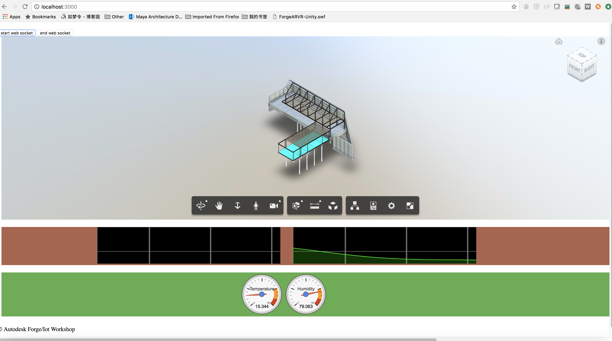

# Forge Viewer IOT Workshop 
Connect Forge viewer with IOT device sample

This is a skeleton sample to demo the connection of [Intel Up2 Grove board](https://software.intel.com/en-us/upsquared-grove-getting-started-guide) with [Forge Viewer](https://developer.autodesk.com/en/docs/viewer/v2/overview/). 

## Setup
1. For using this sample, you need an Autodesk developer credentials. Visit the [Forge Developer Portal](https://developer.autodesk.com), sign up for an account, then [create an app](https://developer.autodesk.com/myapps/create). Finally make a copy of client id and client secret. 
2. Please use other ways to translate the source model to the format for Forge Viewer in advance. Get the model base64 urn.
3. Prepare a Intel Up2 Grove board, and make sure the board has been setup correctly with the guidance of [Step 1: Make Board Connections](https://software.intel.com/en-us/upsquared-grove-getting-started-guide-power-on-board)
4. Connect Temperature and Humidity sensor to I2C-2, and LCD sensor to I2C-3
5. Fork the [Arduino Test Script](https://create.arduino.cc/editor/decemberpei/e75b2308-b66e-4f91-acd1-a9a211631369/preview) to your [Arduino Creator](https://create.arduino.cc/editor). In this demo, we use the broker test.mosquitto.org:1883. Please ensure the macro of Address is test.mosquitto.org:1883
6. In the script of of #5, name the TOPIC_ONE & TOPIC_TWO in corresponding to the const MQTT_TOPIC_TEMPERATURE & MQTT_TOPIC_HUMIDITY in [server.js](server.js). e.g. "sensors/temperature/data" & "sensors/humidity/data".

## Local Test

1. Set enviroment variables of Forge credentials or hard-coded the credentials in [credentials.js]. 

    Mac OSX/Linux (Terminal). 
    
        export FORGE_CLIENT_ID=<<YOUR CLIENT ID FROM FORGE DEVELOPER PORTAL>>
        export FORGE_CLIENT_SECRET=<<YOUR FORGE CLIENT SECRET>>
    
    Windows (command line)

        set FORGE_CLIENT_ID=<<YOUR CLIENT ID FROM FORGE DEVELOPER PORTAL>>
        set FORGE_CLIENT_SECRET=<<YOUR FORGE CLIENT SECRET>>

2. In [www\js\index.js](www\js\index.js), replace the testdbid with your own demo dbid.
3. Run the project, it will open up a browser page with the model loaded in the page. http://localhost:3000
4. Power **Intel Up2 Grove board**, deploy **Arduino Test Script** to thr board to start to collect the data. Check Arduino Creator >> Monitor if the data is broadcast to mqtt successfully.
5. Click *start web socket* in http://localhost:300, you will see the value of timeline and chart will be changed based on the data from Intel board, and also the object with testdbid will change the color with the data from device.

Afterwards, you should see your app displayed in your browser:

## Written By
Zhong Wu (Forge Partner Development)
